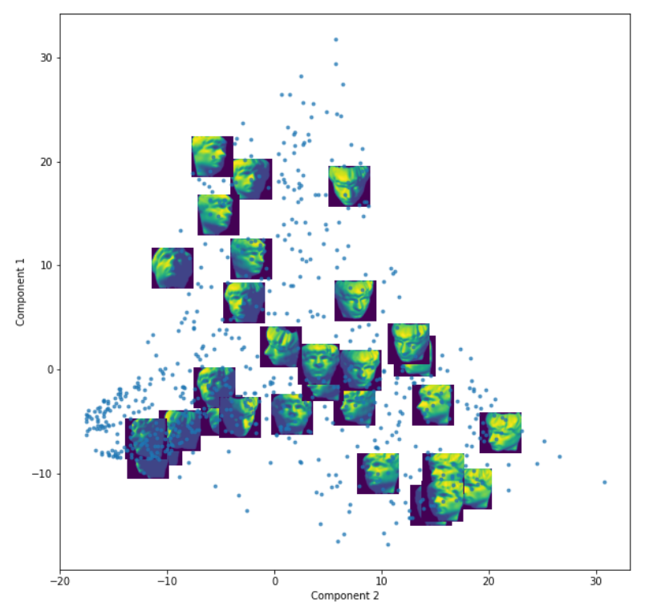
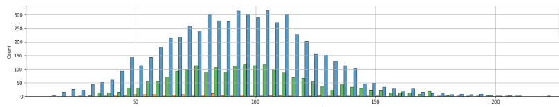
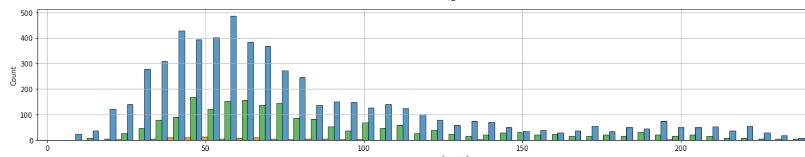

## Images

1. Check on the format of the images

- Image Size
- Image file format

2. Reading in images

There are currently two main packages for reading in images to your scripts- Pillow and OpenCV  

Pillow is the more straightforward of the two. This is because we normally associate images with RGB colours and the colour intensity is [0 - 255].  

OpenCV (or cv2) reads in images to BGR and the colour intensity range is [0-1]. Additionally, OpenCV tends to be harder to be packaged in environment files and docker. 

The main reason why inference goes wrong is because people tend to mix the two. From surveying the current tensor libraries, they tend to use OpenCV to open the image files. Thus, do use this guide for which image library to use:

1. EDA - OpenCV or Pillow
2. Inference pipeline - OpenCV
3. Training Pipeline - OpenCV

## EDA  

EDA for computer vision tasks is slightly different from tabular data. 

A good resource for EDA: [Fashion](https://www.kaggle.com/code/shivamb/imaterialist-fashion-eda-object-detection-colors/notebook)

These are some of the EDA tasks to follow:

### Basic Image Analysis  
The basic image analysis considers the broad characteristics of the images that have been obtained.  

The guiding questions are as such:   
1. What is the number of images provided? Is this the number of images promised to be delivered for experiments?
1. What is the format of images eg JPG/PNG/JPEG? If there are multiple formats given, what are the counts for each image format? 
1. What are the image sizes/resolution (eg 1080x960)? If there are multiple dimensions, what are the counts for each dimension?
1. How similar are the images to each other? You can do an EDA to check on this by performing image hashing to discover groups which are similar to each other.

### Colour Intensity of Image

The colour intensity of images can be explored by either mean or mode of the channel values of each image. The goal for analysing annotations' colour channels is to understand what the dominant colours are. For example, images in forest settings may have more green, and images along water bodies are expected to be blue-dominated. This also ties in with annotations, where if the annotated objects are similar in colour values, the model would need to rely on feature other than colours such as edges. 

### Brightness

Brightness values are closely related to colour intensity. If the colour intensity for all channels are higher, then the images may appear to be brighter than normal and vice versa. It is thus the job of the AI Engineer to explore the data to ensure the brightness values of the images are of the normal range. Otherwise, they would need to scale up or down the brightness levels to ensure that the images for training are consistent.

### Contrast

Contrast is the pixel to pixel difference in channel values. For example, a green frog in Bukit Timah Nature Reserve would be said to have low contrast. This makes edge detection more important for the model.The onus is thus on the AI Engineer to explore the images to ensure the contrast levels are of the normal range. Otherwise, they would need to employ contrast adjustment techniques to ensure contrast values are normalised. 

### Image Similarity
1. PCA or ISOMAP per channel can be performed on the images to see how the images are related to each other.



## Annotations (Basic Overview)

### Bounding Boxes Formats

1. COCO - [x_min, y_min, width, height]
1. YOLO - [x_center, y_center, width, height]
1. Pascal VOC - [x_min, y_min, x_max, y_max]

For example, if the given format is in Pascal VOC, and the model requires it in YOLO format, we would need to convert the annotations to YOLO format for training.  

An example for during inference: Read images using CV2, run YOLOv3 model, convert and return in the desired format according to what is required to be delivered.

### Masks Format

Masks annotations gives the pixel-wise positions of the mask.

Masks are provided in an array of x-y pairs. It will typically be:

```
masks_per_instance = [x_1, y_1, x_2, y_2, ... x_n, y_n]
```

Thus, when reading this, you can choose to distangle it by doing two list comprehensions

```
x_per_instance = [masks_per_instance[i] for i in range(0,n*2,2)]
y_per_insance = [masks_per_instance[i] for i in range(1,n*2,2)]
```

Masks may also come in the form of PNG files, where the PNG's image size would correspond to the original image size. 

## Annotations EDA

### Basic Annotations Analysis

The basic annotations analysis attempts to find characteristics of the annotation such as number (and proportion) of classes as well as the values of the bounding boxes/ masks. This is useful because it helps determine what type of metrics should be used, how the data (images) should be split and how much training needs to be done.  

Guiding Questions - 
1. How many instances of each classes are there?
1. Bounding Box - what is width and height distribution overall and per class?
1. Bounding Box - what is the overall size (W*H) overall and per class?
1. Bounding Box - What are the top few Width/Height combination? This can be found using clustering methods.
1. Segmentation - what is distribution of the mask pixel counts overall and per class?

### Colours of Annotations
As with images, the annotations have 1 or more channels per pixel, with the most popular format being Red, Green and Blue (RGB). The utility for this mainly lets the researchers know if the model would be better served trying to use certain channels when making inference. 

#### Average Intensity per channel  
To explore this for all classes, we can firstly average the colour intensity of the annotation's pixels per channel.  

Secondly, countplot of the average colour intensity values could be generated. The image below shows the counts of each annotation with the average values of the red channels separated by classes. In this case, there are three classes, with one of the class having very spread out red channel intensity, and the other two classes having colour intensity being normally distributed.



#### Mode Intensity per channel    

Besides averaging the intensity per annotation, the highest occurring value (mode) of the intensity of the annotation can also be used to analyse the colour of the annotation.  



There are many other ways to visualise this. The main goal is to check on the colour distribution among the annotations. 

### Classes

Some models have 0-indexed, while some start from 1. 

## Annotations Random Sample Checks

### Bounding Box and Mask Random Sample Checks

Bounding Boxes Random Sample Check refers to performing a check by sampling images and analysing their annotations. 

1. Are the masks/boxes drawn tight enough? 
1. Are the objects being occluded? In other words, were parts of the object blocked by another object?
1. Are the objects truncated? In other words, were parts of the objects being spilling out of the image?

For occlusion and truncation, it is recommended to include "occlusion" and "truncation" in the metadata of the annotation. 

## References

Perceptual Hashing - https://www.phash.org/
VOC annotation guide - http://host.robots.ox.ac.uk/pascal/VOC/voc2011/guidelines.html
The Scientist and Engineer's Guide to Digital Signal Processing - https://www.dspguide.com/ch23/5.htm